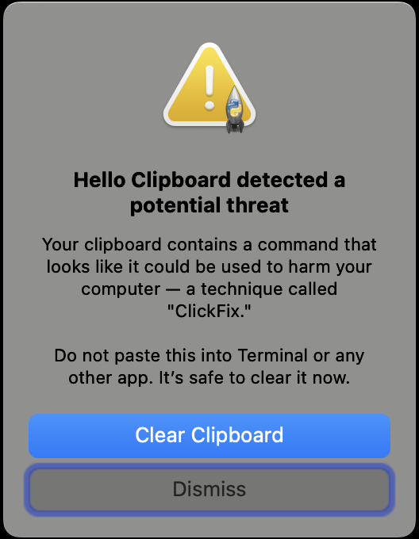

# Hello Clipboard

A macOS menu bar app that lets you see and edit your clipboard in a floating window. Say hello to your clipboard — it's been there all along, and now you can finally meet it.

## What it does

- Adds a 📋 icon to your macOS menu bar
- Polls the system clipboard every 500ms for changes
- Opens an editable text window where you can view and modify clipboard contents — edits are written back to the clipboard in real time
- Displays copied images with scaling to fit the window
- Closing the window hides it (use the menu bar icon to reopen, or "Quit" to exit)
- Detects and warns about ClickFix clipboard attacks before you accidentally paste a harmful command

## Requirements

- macOS
- Python 3.10+ (the built-in macOS system Python 3.9 is **not** supported)
  - Install via [Homebrew](https://brew.sh): `brew install python@3.12`
- [uv](https://docs.astral.sh/uv/) — fast Python package installer
  - Install via Homebrew: `brew install uv`

## Installation

```bash
git clone https://github.com/pcantalupo/hello-clipboard.git
cd hello-clipboard
./install.sh
```

### What `install.sh` does

| Step | Detail |
|------|--------|
| Creates `.venv/` | A Python virtual environment inside the project directory (via `uv`) |
| Installs package | Runs `uv pip install .` using `pyproject.toml` (`pyobjc-framework-Cocoa`) |
| Generates LaunchAgent plist | Writes `com.user.hello-clipboard.plist` to `~/Library/LaunchAgents/` with paths resolved to your machine |
| Loads the agent | Calls `launchctl load` so the monitor starts on login |

### Files installed outside the repo

| File | Location | Purpose |
|------|----------|---------|
| `com.user.hello-clipboard.plist` | `~/Library/LaunchAgents/` | macOS LaunchAgent that auto-starts Hello Clipboard on login |
| `hello-clipboard.log` | `/tmp/` | stdout log |
| `hello-clipboard.err` | `/tmp/` | stderr log |

### Generated plist contents

The plist points to the `hello-clipboard` entry point installed in the venv:

```xml
<key>ProgramArguments</key>
<array>
    <string>/path/to/hello-clipboard/.venv/bin/hello-clipboard</string>
</array>
```

### "Background Items Added" notification

After installation, macOS will show a notification saying **"hello-clipboard" is an item that can run in the background**. This is expected — it's the Hello Clipboard LaunchAgent. You can review it in **System Settings > General > Login Items & Extensions**.

## Usage

After installation, Hello Clipboard starts automatically on login. To interact with it:

- **Open the window** — click the 📋 icon in the menu bar, then "Show Window"
- **Edit clipboard text** — type in the window; changes are written back to the clipboard immediately
- **View clipboard images** — copied images are displayed scaled to fit the window
- **Clear an image** — click the "Clear" button or press Delete/Backspace while viewing an image
- **Hide the window** — press Cmd+W, click the window's close button, or click "Hide Window" in the menu bar
- **Quit** — click "Quit" in the menu bar

### Red badge

When your clipboard contains any text, a small red dot appears on the 📋 menu bar icon as a reminder. It disappears when the clipboard is cleared.

### ClickFix protection

Hello Clipboard watches for clipboard content that looks like a malicious command — a social-engineering technique called [ClickFix](https://www.malwarebytes.com/blog/threat-intelligence/2024/03/clickfix-how-to-infect-your-pc-by-following-fake-instructions), where attackers trick users into copying and pasting harmful commands into Terminal.

When a potential threat is detected, a warning appears immediately:



- **Clear Clipboard** — removes the dangerous content immediately (recommended)
- **Dismiss** — closes the warning without clearing; the red badge remains on the menu bar icon

The warning appears on launch if malicious content is already on the clipboard when Hello Clipboard starts, and also whenever new suspicious content is copied during normal use. The menu bar remains fully accessible while the warning is shown.

### Run manually (without LaunchAgent)

```bash
.venv/bin/hello-clipboard
```

### Check logs

```bash
cat /tmp/hello-clipboard.log
cat /tmp/hello-clipboard.err
```

## Uninstallation

```bash
./uninstall.sh
```

This unloads the LaunchAgent, kills any running Hello Clipboard process, and removes the plist from `~/Library/LaunchAgents/`. The project directory and venv are left intact.

## License

MIT — see [LICENSE](LICENSE) for details.

## Project structure

```
hello-clipboard/
├── hello_clipboard.py     # Main application (pure AppKit, no tkinter)
├── detection.py           # ClickFix clipboard threat detection
├── pyproject.toml         # Python packaging and dependencies
├── install.sh             # Sets up venv, deps, and LaunchAgent
├── uninstall.sh           # Removes LaunchAgent and kills running process
├── docs/                  # Screenshots and documentation assets
└── .venv/                 # Created by install.sh (not committed)
```
