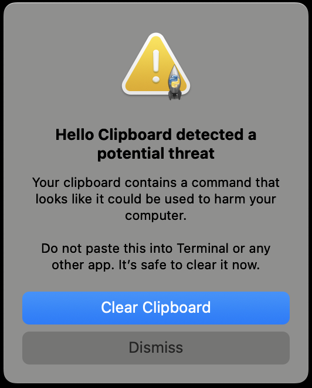

# Hello Clipboard

Say hello to your clipboard — it's been there all along, and now you can finally meet it. A macOS menu bar app that lets you see and edit your clipboard in a floating window.

## What it does

- Adds a 📋 icon to your macOS menu bar
- Opens an editable text window where you can view and modify clipboard contents — edits are written back to the clipboard in real time
- Displays copied images with scaling to fit the window
- Keeps a **history** of the last 25 clipboard entries (text and images) — click any entry in the History submenu to restore it instantly
- Auto-clears the clipboard on a configurable interval (default: 5 minutes)
- Closing the window hides it (use the menu bar icon to reopen, or "Quit" to exit)
- Detects and warns about potentially harmful clipboard commands before you accidentally paste them

## Requirements

- macOS
- Python 3.10+ (the built-in macOS system Python 3.9 is **not** supported)
  - Install via [Homebrew](https://brew.sh): `brew install python@3.12`
- [uv](https://docs.astral.sh/uv/) — fast Python package installer
  - Install via Homebrew: `brew install uv`

## Installation

```bash
git clone https://github.com/pcantalupo/hello-clipboard.git
cd hello-clipboard
./install.sh
```

`install.sh` creates a `.venv/`, installs dependencies, writes a LaunchAgent plist to `~/Library/LaunchAgents/`, and loads it so Hello Clipboard starts on login.

### Files installed outside the repo

| File | Location | Purpose |
|------|----------|---------|
| `com.user.hello-clipboard.plist` | `~/Library/LaunchAgents/` | macOS LaunchAgent that auto-starts Hello Clipboard on login |
| `hello-clipboard.log` | `/tmp/` | stdout log |
| `hello-clipboard.err` | `/tmp/` | stderr log |

### "Background Items Added" notification

After installation, macOS will show a notification saying **"hello-clipboard" is an item that can run in the background**. This is expected — it's the Hello Clipboard LaunchAgent. You can review it in **System Settings > General > Login Items & Extensions**.

## Usage

After installation, Hello Clipboard starts automatically on login. To interact with it:

- **Open the window** — click the 📋 icon in the menu bar, then "Show Window"
- **Edit clipboard text** — type in the window; changes are written back to the clipboard immediately
- **View clipboard images** — copied images are displayed scaled to fit the window
- **Clear clipboard** — click the "Clear" button (always visible at the bottom of the window), or press Delete/Backspace while viewing an image
- **Hide the window** — press Cmd+W, click the window's close button, or click "Hide Window" in the menu bar
- **Quit** — click "Quit" in the menu bar

### Clipboard History

Hello Clipboard remembers the last 25 items you copied (text and images). To browse and restore them:

1. Click the 📋 menu bar icon
2. Hover over **History**
3. Click any entry (shown as `HH:MM:SS  preview…`) to restore it to the clipboard

The main window updates immediately when you restore a history entry. To wipe all stored entries, click **Clear History** at the bottom of the submenu.

> **Note:** History is held in memory only and is lost when the app quits or restarts.

### Red badge

When your clipboard contains any content (text or image), a small red dot appears on the menu bar icon as a reminder. It disappears when the clipboard is cleared.

### Auto Clear

Hello Clipboard can automatically clear your clipboard after a set interval, so sensitive content doesn't linger. Click the 📋 menu bar icon, hover over **Auto Clear**, and choose an interval:

| Option | Interval |
|--------|----------|
| Disabled | Never |
| 30 Seconds | 30 s |
| 5 Minutes | 5 min *(default)* |
| 1 Hour | 1 hr |
| 24 Hours | 24 hr |

A checkmark indicates the active setting. The timer resets whenever you change the interval.

### Suspicious command protection

Hello Clipboard watches for clipboard content that looks like a malicious command — where attackers trick users into copying and pasting harmful commands into Terminal.

When a potential threat is detected, a warning appears immediately:



- **Clear Clipboard** — removes the dangerous content immediately (recommended)
- **Dismiss** — closes the warning without clearing; the red badge remains on the menu bar icon

The warning appears on launch if malicious content is already on the clipboard when Hello Clipboard starts, and also whenever new suspicious content is copied during normal use. The menu bar remains fully accessible while the warning is shown.

### Run manually (without LaunchAgent)

```bash
.venv/bin/hello-clipboard
```

### Check logs

```bash
cat /tmp/hello-clipboard.log
cat /tmp/hello-clipboard.err
```

## Uninstallation

```bash
./uninstall.sh
```

This unloads the LaunchAgent, kills any running Hello Clipboard process, and removes the plist from `~/Library/LaunchAgents/`. The project directory and venv are left intact.

## License

MIT — see [LICENSE](LICENSE) for details.

## Project structure

```
hello-clipboard/
├── hello_clipboard.py     # Main application (pure AppKit, no tkinter)
├── detection.py           # Clipboard threat detection
├── pyproject.toml         # Python packaging and dependencies
├── VERSION                # Package version
├── install.sh             # Sets up venv, deps, and LaunchAgent
├── uninstall.sh           # Removes LaunchAgent and kills running process
├── tests/                 # Test suite
├── docs/                  # Screenshots and documentation assets
└── .venv/                 # Created by install.sh (not committed)
```
